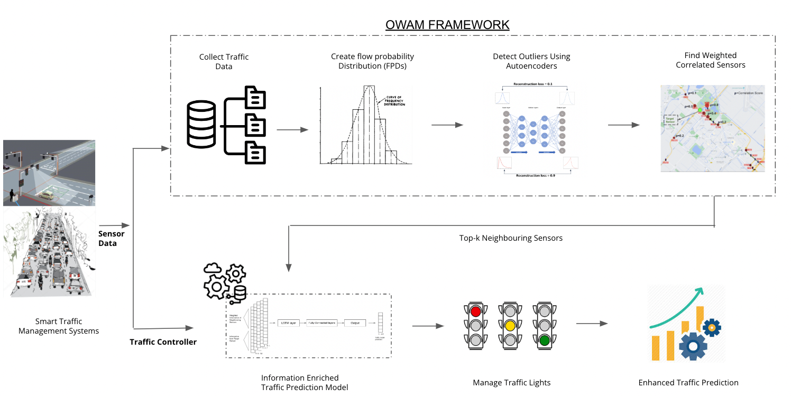
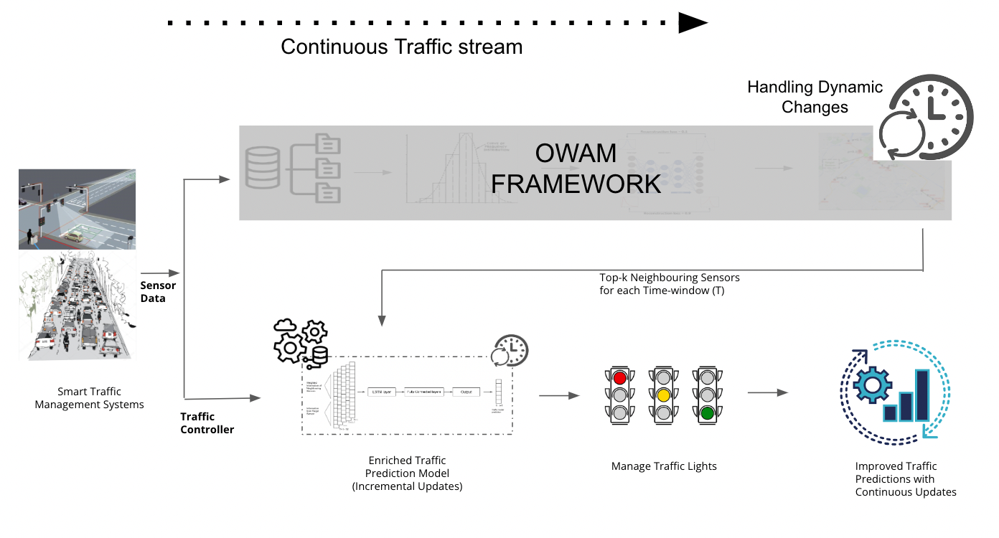

# OWAM Framework
**Outlier Weighted Autoencoder Modeling Framework** : This thesis emphasizes the rising importance of traffic modeling for transportation systems optimization. Despite extensive research, previous studies have overlooked outlier impact and real-time analysis. The focus here is on improving vehicle traffic flow prediction, especially in outlier scenarios, both offline and real-time. A new approach, Outlier Weighted Autoencoder Modeling (OWAM), is introduced. Autoencoders identify anomalies for effective abnormal traffic pattern handling. Weighted correlation analysis evaluates the influence of nearby sensors on the target sensor’s flow, enhancing LSTM-based traffic models. OWAM also serves as an outlier-based real-time update strategy, adapting to changing traffic patterns. Testing against various datasets highlights OWAM's accuracy-efficiency balance. Although it doesn't outperform Graph techniques in RMSE, OWAM excels in dynamic outlier-based updating, enriching adaptive traffic prediction models for transportation management.


**OWAM:**
<p align="center">
  
</p>


**OWAM with Incremental Updates :**
<p align="center">
  
</p>


## In order to run the code, please follow the below steps:

1. Clone the repository
```
git clone https://github.com/himanshudce/OWAM.git
```

2. Install the requirements (This code contains two seperate enviorments due to compatibility issues with pytorch)

    A. Install requirements_1.txt for installing the requirements for the OWAM framework (python - 3.10.10)
    ```
    pip install -r requirements_1.txt
    ```

    B. Install requirements_2.txt for installing the requirements for the outlier models -DAADS (Python - 3.9.16) 
    ```
    pip install -r requirements_2.txt
    ```

3. Run the Notebooks in the notebooks folder for reproducing the results presented in the thesis report. 

    **Note:** In this project, due to multiple experiments(some variable changes are required to perform eperiments in code), various dependencies and the use of the earlier projects, Notebooks are prefered over standard python files which can be difficult to reproduce results. Run the notebooks in the following order for reproducing the results.

    1. ```data_preprocessing.ipynb``` for preprocessing the data and basic data analytics (requirements_1.txt)
    2. ```autoencoders_daads.ipynb``` for training the autoencoders and other outlier models using the preprocessed data (requirements_2.txt) 
    3. ```correlation_analysis.ipynb``` for generating the outlier correlation scores and correlation analysis (requirements_1.txt)
    4. ```LSTM_OWAM.ipynb``` for training the LSTM model using the OWAM framework (requirements_1.txt)
    5. ```LSTM_OWAM_real_time.ipynb``` for training the LSTM model using the OWAM framework with incremental updates (requirements_1.txt)
    6. ```results.ipynb``` for generating the results and plots (requirements_1.txt)

**NOTE** - 
1. All the experiments are already performed and the results are stored in the ```results``` folder. The results can be reproduced by directly running the ```results.ipynb```. 
2. The hague dataset can not be shared as it is not public. please mail on **h.choudhary@student.tue.nl** to get the information regarding the dataset access. For the other datasets please use the following link and paste them in a new ```data``` folder in the repo. 

    link - https://drive.google.com/drive/folders/1c-CKmFwtsjb8byuxarG-LksK0Clb4YfY?usp=sharing


# GNN Networks  

Use the following link to generate training data for GNNs for the hague GNN_raw_data  - https://github.com/liyaguang/DCRNN

- Generate train, test and val data
- Generate distance based adjcency matrix


To run different GNN models follow - https://github.com/tsinghua-fib-lab/Traffic-Benchmark 

The below results are for 1 epoch with 70/20/10 split between train, test and validation datasets


===== \
**Results for 3 runs**

valid	MAE	RMSE	MAPE \
mean:	10.2460	13.5316	0.8379 \
std:	14.4900	19.1365	1.1849


test|horizon	MAE-mean	RMSE-mean	MAPE-mean	MAE-std	RMSE-std	MAPE-std 

3	10.1361	12.3946	1.0670	14.3346	17.5286	1.5089 \
6	9.4435	12.1124	0.9348	13.3551	17.1295	1.3221 \
9	9.1918	12.1480	0.8508	12.9992	17.1799	1.2032 \
12	9.2029	12.1316	0.8568	13.0149	17.1567	1.2117 
